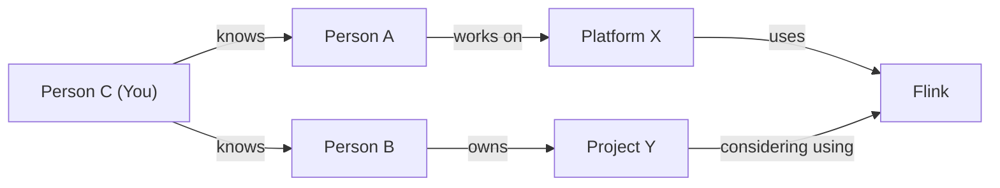
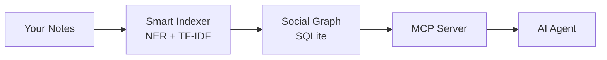

# The hidden social graph in Engineering Orgs
Have you ever realized 2 months too late that someone in your org already solved the exact problem you've been struggling with?

I've been thinking a lot about social sciences like economics, politics, and technology policy, and that got me reflecting on how things actually work in large engineering organizations. As I grow in my software engineering career, I increasingly realize that engineers operate inside a social graph. Good engineering does not happen in a vacuum; you need people to get things done, and people need you to get their things done.

Helping people get things done, knowing the right people to remove blockers, knowing who to approach, and what to prioritize based on conversations. This is the bulk of the engineering problem today. Let's see this through an example:

* **Person A** is working on **Platform X**
* **Platform X** uses **Flink**
* **Project Y** is owned by **Person B**
* **Project Y** is considering using **Flink**
* **Person B** is not aware of **Person A** or **Platform X**
* **Person C** knows both people (let's say **Person C** is **You**)



An obvious social structure appears. Now let's say **B** is looking for someone in the company who has prior experience with Flink. You notice that, connect **B** to **A**, and that helps **B** get things done faster.

This is an isolated example, but in organizations with a large number of engineers, it's hard to keep track of such connections. On top of that, there can be different types of relationships: ownership of projects, reporting structures, 1:1 conversations, meetings, tasks that arise from meetings.

This creates a very complex social graph. It's not a knowledge graph, because we're not navigating knowledge of things, we're navigating social structure. And it's important to be able to effectively navigate that complexity. (It's entirely possible that I'm the only person who struggles with managing context, but oh well!)

# Can we leverage this structure?
Let's look at a slightly more complex scenario. Let's have a log of events that happened (completely fictional events) -

1. I saw Person A talk about Tool A. I took a short note of it. I don't really know this person, but I noted the relationship between them and Tool A.
2. Months pass by and I've completely forgotten about it.
3. Had a meeting with Team X, and they also use Tool A, but in a different way. I took note of it.
4. 3 more events happen where Tool A is being used, each time in a different way. I have notes of them all, but I didn't remember that there are several other ways people are using Tool A.

These are completely isolated events, but they share a common thread: Tool A. There's no standardization of how it's being used, and there's an opportunity to fix that, but it's not easy to recognize!

> What if we had a way to automatically index this data and build a social context graph? One that implicitly ties all these isolated events on a common thread?

I looked for such a system in the wild, but the majority of popular tools are designed for navigating knowledge, not social graphs and events. So I set out to build one myself, with very simple goals:

1. I should be able to take notes, from which we can find entities and their relationships
2. These relationships should be searchable and relevant documents should be retrievable
3. We should be able to use AI to get insights and optimize our work based on these social graphs (with as few tokens as possible)

# Memnode
## What it looks like
Here's what using memnode actually looks like. Let's say we type in our terminal:
```
memnode add person:sarah-chen
```
It opens up a text editor (vim in this case)


Next you type in:
```
memnode add project:ingestion-platform
```
You add some details:


There are two outcomes:

1. Automatic relationship inference (using NER)
```
memnode show project:ingestion-platform
```


2. AI agent interface via MCP


## How it works

Under the hood, memnode is a markdown-based note-taking service that automatically indexes anything you create through it and stores it in local SQLite. It's then exposed through an MCP server for AI agents to derive insights from. It's as simple as:
``` bash
# this opens up an editor for you to take short notes about this person
memnode add person:A
# or alternatively
memnode capture # just a quick note, automatically indexed for you!

# if you want more control
memnode add person:A
memnode add project:X
memnode link person:A project:X --as owns # explicit graph creation
```
While you edit, memnode watches the file. Once you close it, the contents are indexed by spaCy and TF-IDF to infer entities and relationships. Later, you can talk to your favorite AI agent (Claude Code, Open Code, Claude Desktop, etc.) to converse about your data.

# Architecture

## CLI interface
```
memnode add entity:name
memnode link entity:name entity:name --as relationship
memnode list
memnode capture
memnode 1on1 entity:name
memnode todo
```
And many more commands to quickly capture notes and context. A file watcher monitors these changes and automatically indexes them.

## Smart Indexing
NER and TF-IDF infer entity types and their relationships, building graphs from each document you edit: complex relationships between people, projects, tools, and initiatives.

## SQLite Index
All notes and relationships are stored locally in SQLite, keeping everything on your machine.

## MCP Server
An MCP server interacts with your index and notes, giving AI agents context on what's going on and what you may need insights on.

## High Level Design
Here's a simple diagram of how the system works. You can read more on the [Memnode GitHub Repository](https://github.com/bashketchum02/memnode), along with comprehensive usage documentation.



# "Why do this? Seems complex"
> Because we can leverage structure to save tokens & our wallets

The primary reason I'll be using this is to hold a large amount of organizational context in notes, without needing to dump all of it into an AI agent or needing an LLM to find relationships. It lets me leverage the underlying social structure (and save a gazillion dollars in token costs) without needing complex vectorization or ranking. We simply traverse graphs and synthesize information from them.

# Why not just use...

## Obsidian with backlinks
You might wonder: why not just use Obsidian with backlinks? The difference is typed entities and automatic relationship inference. In Obsidian, a link is just a link. In memnode, `person:sarah` mentioned in `project:platform-v2` automatically creates a `contributes_to` relationship that's queryable. You don't manually wire up connections; the system infers them for you.

## CRMs
CRMs are structured around deals, pipelines, and customer contacts, a very different mental model. Quick engineering notes about who-knows-what don't fit naturally into a CRM workflow.

## Notion
I like Notion, but it doesn't have a straightforward way to handle this use case. There's no automatic relationship inference or typed entity model. I built memnode because it's the most intuitive workflow for myself.

# `memnode` vs RAG

| Aspect | RAG | memnode |
|--------|--------------------------------------|---------|
| Data structure | Flat chunks of text + embeddings | Graph of typed entities + relationships |
| Retrieval | Semantic similarity search | Graph traversal + relationship queries |
| Query | "Find text similar to this query" | "Who knows about X?", "How are A and B connected?" |
| Context | Retrieved chunks dumped into prompt | Structured context with relationships |
| Intelligence | At query time (LLM does the work) | At index time (NLP pre-computes relationships) |

## The Core Difference
```
RAG:
Query: "Who should I talk to about auth?"
↓
Embed query → Search vectors → Return top-k chunks → LLM reads all chunks → LLM figures out answer
                                    ↓
                              ~10,000 tokens
memnode:
Query: "Who should I talk to about auth?"
↓
who_knows_about("auth") → Graph traversal → Return person:sarah-chen (knows auth)
                                    ↓
                              ~200 tokens
```
## Why This Matters
1. **RAG is dumb retrieval, smart generation.** You retrieve text chunks and hope the LLM can figure out the answer from them.
2. **`memnode` is smart retrieval, simple generation.** The graph already knows the relationships, so the LLM just needs to format the answer.

# What's next
Memnode is still early, but I'm already using it daily to track context across my org. The roadmap includes better visualization of the social graph, richer MCP tool support, and temporal queries (e.g., "what changed since my last 1:1 with Sarah?"). If this resonates with you, check out the [GitHub repo](https://github.com/bashketchum02/memnode) and give it a try. I'd love to hear how others think about this problem.